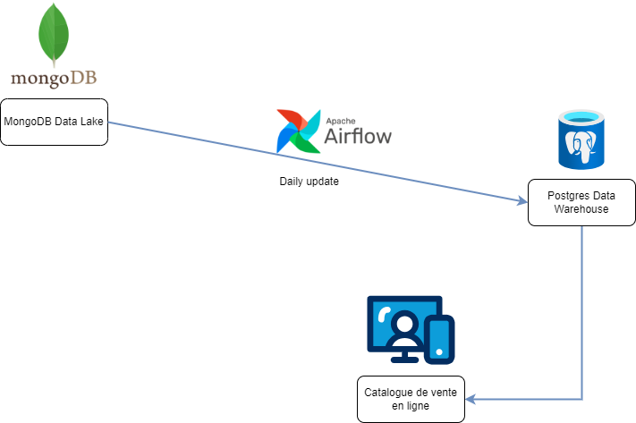

# Mise en place d'un pipeline ETL depuis une base MongoDB - Projet Blent.ai

## Introduction

Ce projet a été réalisé dans le cadre d'une formation proposée par Blent.ai. Une enseigne de jeux vidéos souhaite afficher une liste de ses jeux les mieux notées sur son site internet. Pour cela, l'entreprise souhaite récupérer les avis récents des clients depuis le data lake de l'entreprise qui est une collection MongoDB et qui contient toutes les archives des avis données aux jeux vidéos de l'enseigne. Nous allons devoir mettre en place une architecture qui à partir de ce data lake alimente un data warehouse, mis à jour régulièrement et qui servira à afficher les jeux les mieux notées sur la page d'accueil du site de l'enseigne.
 

## Data Lake MongoDB

Comme nous avons vu, l'entiereté des avis crées pour les jeux de l'enseigne sont stockées dans une base MongoDB par d'autres services backend. Pour chaque avis, la collection enregistre ces variables :

- reviewerID : identifiant unique de l'utilisateur.
- verified : indique si l'utilisateur est un utilisateur vérifié (et non un robot).
- asin : identifiant unique du produit.
- reviewerName : nom/pseudo de l'utilisateur.
- overall : note attribuée par l'utilisateur au jeu vidéo.
- summary : résumé de l'avis.
- unixReviewTime : timestamp de l'avis.
- reviewTime : date de l'avis.

## Data Warehouse PostgreSQL

Pour réaliser ce projet en respectant les conditions de l'enseigne, nous devons créer un Data Warehouse qui permettra de stocker les jeux les mieux notées des 6 derniers mpis. Pour cela, nous avons choisi une base de données relationelles PostgreSQL. Les jeux les mieux notées se retrouvent donc dans une table dont les colonnes sont obtenues à partir des données archivées du data lake :

- id_game : identifiant unique du produit.
- nb_ratings : le nombre d'avis donnés au jeu dans les 6 derniers mois.
- latest_rating : la note la plus récente donnée au jeu.
- oldest_rating : la note la plus ancienne donnée au jeu (dans les 6 derniers mois).
- avg_rating : la note moyenne donnée au jeu dans les 6 derniers mois.

## Alimentation du Data Warehouse avec Airflow

Pour alimenter notre data warehouse et le maintenir à jour, nous créons un DAG Airflow qui s'effectuera tous les jours. Ce DAG aura comme fonction de récupérer tous les avis qui datent d'il y a 6 mois ou moins de la collection MongoDB, groupés par identifiant de jeu et en créant les champs définis dans la section précédente. Une fois cela fait, nous récupérons seulement les 15 jeux qui ont la note moyenne la plus importante, et on ajoute ces jeux au data warehouse.

## Architecture
Nous pouvons modéliser l'architecture de ce projet avec ce diagramme.

